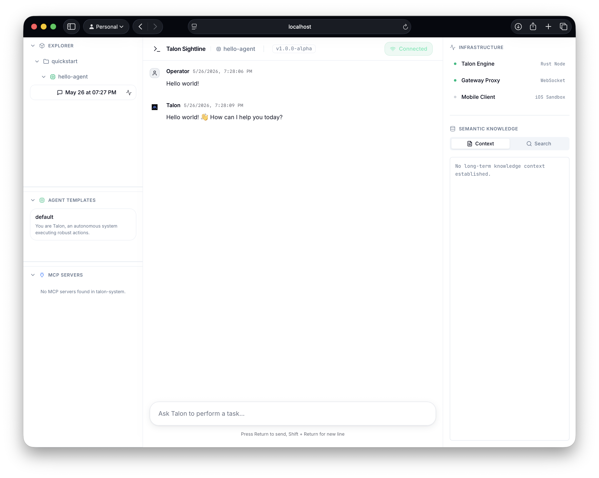

Use Talon when you want agents to run as cloud services, not just as local assistants in a terminal. Talon is for deploying agents that keep durable state, expose APIs, run in workers, share knowledge, use approved tools, wake up on schedules, and can be inspected after they execute.

This quickstart creates a real namespace, agent, session, and chat run on the local cloud-style stack so you can see the core control-plane loop end to end: API request in, durable state persisted, worker execution dispatched, and the result visible in Sightline.

## Prerequisites

- Docker / Docker Compose
- Git
- Rust toolchain for local binaries and CLI work
- provider credentials via `.env` or local keychain

## 1. Clone the repository

```bash
git clone https://github.com/impalasys/talon.git
cd talon
```

## 2. Create `.env`

From the repository root:

```bash
cp .env.example .env
```

Then edit `.env` and set your OpenAI provider key. The checked-in local stack includes the `openai` provider in `talon.compose.yaml`, so the quickstart examples below use that configuration:

```bash
OPENAI_API_KEY=your-real-api-key
```

## 3. Start Talon locally

From the repository root:

```bash
docker compose up --build -d
```

This starts the local compose stack and exposes:

- Sightline UI: `http://localhost:3000`
- Envoy edge: `http://localhost:18789`
- native gRPC gateway: `http://localhost:50051`
- gateway UI HTTP surface: `http://localhost:50052`

It also starts:

- a worker process
- Postgres
- a Pub/Sub emulator
- an init step that applies the default agent template manifest

## 4. Create a workspace namespace

Talon resources are usually managed as manifests so the same agent, namespace, knowledge, and tool definitions can be reviewed, versioned, and applied again in another environment. This quickstart writes temporary manifests under `/tmp` so you can use the same workflow without adding files to the repository.

Namespaces group agents, sessions, knowledge, and tool bindings. Create one for the quickstart:

```bash
cat > /tmp/quickstart-namespace.yaml <<'EOF'
apiVersion: talon.impalasys.com/v1
kind: Namespace
metadata:
  name: quickstart
EOF
```

Apply it:

```bash
cargo run --bin talon-cli -- --gateway http://localhost:18789 --rest apply -f /tmp/quickstart-namespace.yaml
```

## 5. Create an agent directly

Define a simple agent with its full behavior inline:

```bash
cat > /tmp/quickstart-agent.yaml <<'EOF'
apiVersion: talon.impalasys.com/v1
kind: Agent
metadata:
  name: hello-agent
  namespace: quickstart
spec:
    systemPrompt: |
      You are a concise quickstart assistant for Talon.
      Answer directly and keep the response short.
    modelPolicy:
      profiles:
        - name: default
          model:
            provider: openai
            name: gpt-5.4-nano
            temperature: 0.0
EOF
```

Apply it:

```bash
cargo run --bin talon-cli -- --gateway http://localhost:18789 --rest apply -f /tmp/quickstart-agent.yaml
```

Verify it exists:

```bash
cargo run --bin talon-cli -- --gateway http://localhost:18789 --rest get agent hello-agent --namespace quickstart
```

## 6. Create a session

Create a session through the gateway REST surface:

```bash
curl -sS http://localhost:18789/v1/ns/quickstart/agents/hello-agent/sessions \
  -X POST \
  -H 'content-type: application/json' \
  -d '{"ns":"quickstart","agent":"hello-agent"}'
```

The response includes a `sessionId`.

## 7. Chat with the agent over `curl`

Replace `<session-id>` with the value from the previous step:

```bash
curl -sS http://localhost:18789/v1/ui/ns/quickstart/agents/hello-agent/sessions/<session-id> \
  -X POST \
  -H 'content-type: application/json' \
  -d '{"messages":[{"content":"Explain what Talon is in two bullets."}]}'
```

This uses the same browser-oriented UI session surface that Sightline and `@impalasys/talon-chat` use.

## 8. Open Sightline and inspect the run

Open `http://localhost:3000` and connect to `http://localhost:18789`.

In Sightline:

1. open the `quickstart` namespace
2. select `hello-agent`
3. open the session you just created



In Sightline, you can inspect:

- namespaces, which group the resources for a workspace or tenant
- agents, which hold runnable behavior such as prompts, model policy, knowledge, and tool bindings
- sessions, which store durable conversation state and execution history
- schedules, which wake agents for recurring or one-shot background work
- templates, which define reusable agent behavior that multiple agents can share
- knowledge resources, which provide durable context files available to agents in a namespace
- MCP servers and bindings, which expose approved external tools to selected agents

## 9. Read the contracts

- [How Talon Works](../concepts/how-talon-works.md)
- [Runtime Topology](../concepts/runtime-topology.md)
- [Architecture](./architecture.md)
- [Gateway API reference](../reference/generated/gateway-service.md)
- [Manifest schema](../reference/generated/manifests-schema.md)
- [Config schema](../reference/generated/config-schema.md)
